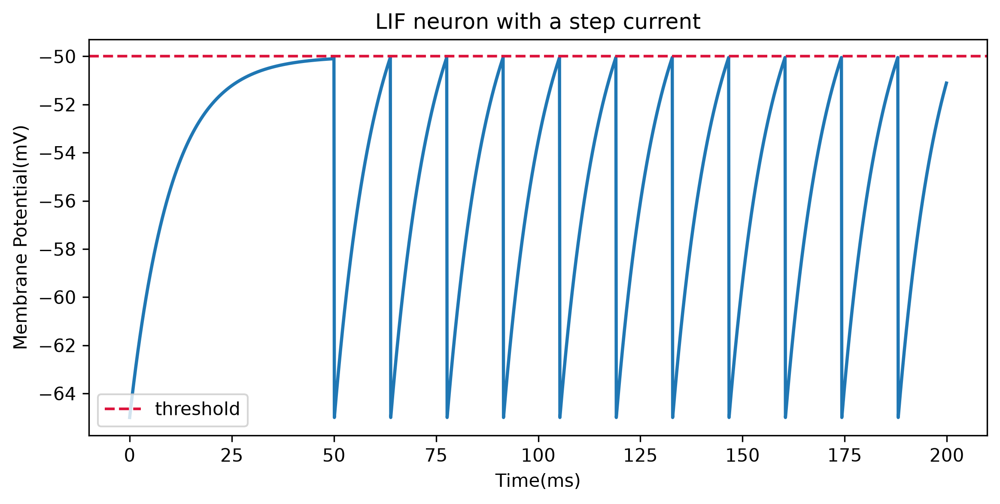
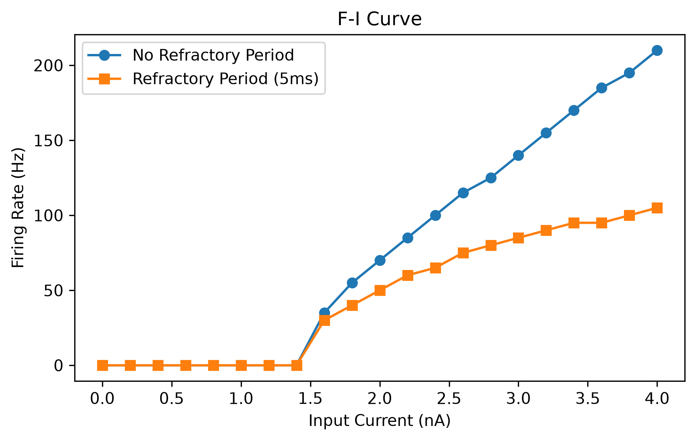

# Leaky Integrate-and-Fire (LIF) Neuron Simulation

A Python simulation of a leaky integrate-and-fire neuron, built with NumPy and Matplotlib. It looks at how the neuron responds to different input currents, when it fires an action potential (spike), and how a refractory period changes its firing.

## What is an LIF neuron?

The LIF neuron is a simplified model of how a real neuron spikes. Think of a leaky bucket: the input current fills the bucket (the membrane voltage rises) while a leak drains it back toward the resting level. When the voltage reaches the threshold, the neuron fires a spike and the voltage is reset to its starting value.

The model is described by this equation:

τ · dV/dt = −(V − V_rest) + R · I
The first term, -(V - V_{rest})$, is the leak. It pulls the voltage back toward rest.
The second term, R, I, is the input. It pushes the voltage up.
τ controls how fast the voltage responds.

A computer cannot solve a continuous equation directly, so the simulation moves forward in small time steps (Euler's method). At each step it computes the rate of change of the voltage and updates it:

V_new = V_old + (dV/dt) * dt

If the voltage reaches the threshold, the time is recorded as a spike and the voltage is reset.

## Parameters
Parameter	Value	         Meaning
dt	       0.1 ms	         Size of each simulation time step
T	       200 ms	         Total simulation time
tau	       10 ms	         Membrane time constant (how fast the voltage responds)
V_rest	   -65 mV	         Resting voltage
V_th	   -50 mV	         Spike threshold
V_reset	   -65 mV	         Voltage the neuron returns to after a spike
R	        10 MOhm	         Membrane resistance (converts current into voltage change)
I	       varies (nA)	     Input current
t_ref	    5 ms	         Refractory period (no firing right after a spike)

## What I did

Simulated a neuron with a step input: 1.5 nA for the first 50 ms, then 2.0 nA.
Built an F-I curve (firing rate vs. input current) by running the simulation for currents from 0 to 4 nA.
Added a 5 ms refractory period and compared the F-I curve with and without it.

## Results

## Response to a step current

At 1.5 nA the voltage rises toward the threshold but never crosses it, so the neuron does not fire. This current is the rheobase, the minimum current needed to make the neuron spike. It can be calculated directly: (V_th - V_rest) / R = 15 mV / 10 MOhm = 1.5 nA. After the input steps up to 2.0 nA, the voltage can reach the threshold, and the neuron fires regularly, with roughly 14 ms between spikes.

## F-I curve

The firing rate is zero below the rheobase (1.5 nA) and rises as the current increases. With a 5 ms refractory period, the neuron fires at a lower rate, and the difference grows at high currents. Because the neuron must wait 5 ms after each spike, its rate can never exceed 200 Hz, so the curve flattens out.

## How to run
Install the libraries: pip install -r requirements.txt
Open code/lif_neuron.ipynb in Jupyter and run all cells.

## What I learned

Building this showed me how a differential equation can be turned into a simple loop that steps through time. I saw that a neuron only generates an action potential when its input current is strong enough for the voltage to reach the threshold, and that the F-I curve summarises this behaviour across many inputs. After adding the refractory period I got to know how a factor like refractory period can decrease the frequency of a neuron to generate action potential.

## Next steps

Add noise to the input current
Compare different time steps (dt) to see how accuracy changes
Build a Hodgkin-Huxley model
Simulate a network of connected neurons# Leaky-Integrate-and-fire-neuron-simulation

